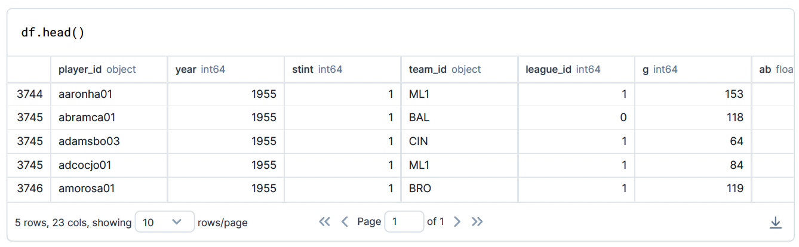
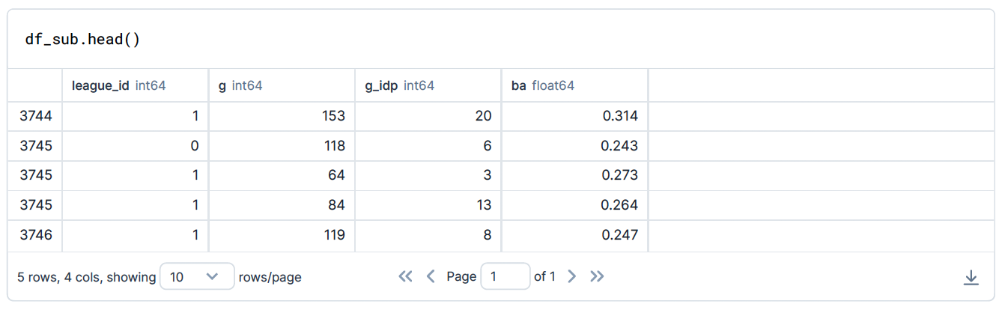
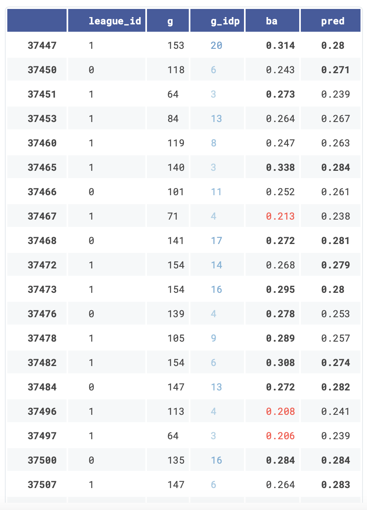
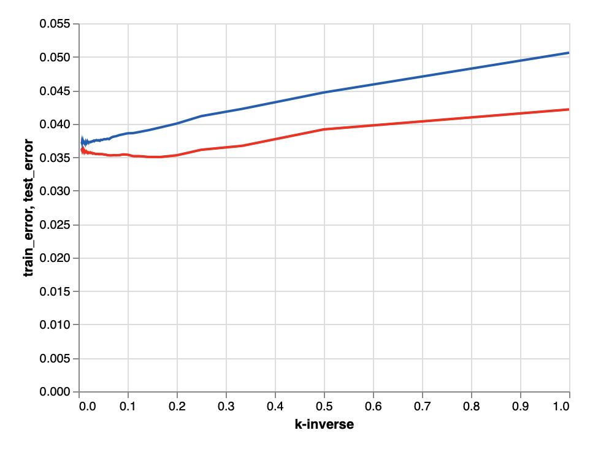
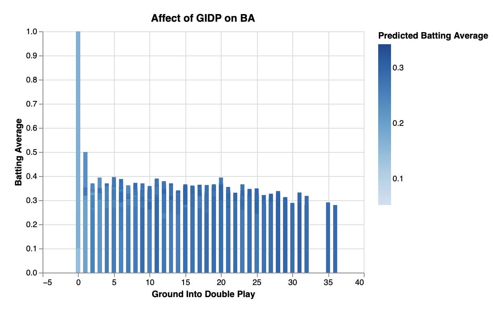

<h1><center><b>Baseball's GIDP Metric Affect on Batting Average</h1></center></b>
<center>By Christina Orengo</center>

## Description
This project involves data analysis using Deepnote and Python.

## Table of Contents
- [Installation](#installation)
- [Introduction](#introduction)
- [Predictive Modeling](#predictive-modeling)
- [Summary](#summary)
- [References](#references)

## Installation
To install the necessary packages, use the following command:

```
pip install -r requirements.txt

df = pd.read_csv('/work/batting.csv', na_values=" ") 
```

## Introduction
In this dataset, batting average is not included as a column despite it being one of the oldest metrics used to determine a players value.

Below, we calculate the batting average by taking the number of hits (h) and dividing it by the number of attempts ((ab) which stands for 'at bats') the player had. Batting average is traditionally rounded to 3 decimal places. We then store these values as a new column in the dataframe. 

```
df['ba'] = round(df['h']/df['ab'],3) 
```

Tracking GIDP is a more recent metric compared to how long the sport has been around. Below we get rid of rows where GIDP information was not tracked and we can see that it started to become a normally used metric starting in 1955. 

We also want to add league type as a potential factor for batting average considering the Americal League(AL) has a designated hitter and National League (NL) does not. 

- 1 for NL 
- 0 for AL 

```
df.dropna(inplace=True) 
df['league_id'] = (df['league_id'] == 'NL') 
df['league_id'] = df['league_id'].astype('int') 
df['g_idp'] = df['g_idp'].astype('int') 
df['g_idp'] = df['g_idp'].astype('int') 
```

To help rid any outliers, we want to set a minimum of games played to at least 50 games. We see that this reduces the number of rows significantly. 

```
# code for drop functionality is linked in references. 

df.drop(df[df['g'] < 50].index , inplace=True) 

print(f"The number of rows in this dataset is now {df.shape[0]}") 
```

The number of rows in this dataset is now <b>22928</b>.



To make our information easily viewable and accessible, we will create a subdataframe with the parameters we are interested in. 

```
df_sub = df[['league_id', 'g','g_idp','ba']].copy() 

df_sub.head() 
```



## Predictive Modeling

Next, we will be setting our parameters and fitting/predicting using KNeighborsRegressor. We will also scale the input information as each category is in different metrics. 

```
X = df_sub[['g', 'league_id', 'g_idp']].copy() 
y = df_sub['ba'] 
```

```
scaler = StandardScaler() 
```

```
scaler.fit(X)
```

```
X_scaled = scaler.transform(X)
```

```
reg = KNeighborsRegressor(n_neighbors=10) 
```

```
reg.fit(X_scaled,y) 
```

Now, we are placing the scaled prediction in it's own column of the sub dataframe and stylizing using pandas styler. We have defined a function that highlights bad batting averages in red for both 'ba' and 'pred' columns and has good batting averages in bold. Additionally, we have set a text_gradient styler for g_idp. 

<b>Notes:</b> The following are linked in references 

- .format code referenced from towardsdatascience 
- table styles code referenced from coderzcolumn 

```
df_sub["pred"] = reg.predict(X_scaled)
```
```
def bad_ba(x): 
  if x<.230: # bad BA 
    return 'color:red' 
  elif x>.270: # great BA 
    return 'font-weight: bold' 
  else: 
    return None 
```

Below, we are finding the max value of g_idp to set our vmax value in pandas styler. 

```
df_sub['g_idp'].max() 
```

```
df_sub.style.applymap(bad_ba,subset=["ba","pred"])\ 
            .format({'ba': "{:.3}", 
                     'pred': "{:.3}"})\ 
            .text_gradient(cmap="Blues",subset='g_idp',vmin=-20,vmax=40)\ 
            .set_table_styles([{"selector":"thead", 
                                "props":"background-color:#0E3386; color:white; border:2px solid #cc3433;"},] 
```



We want to determine how accurate our model is and whether it is underfitting or overfitting. 

```
X_scaled_train, X_scaled_test, y_train, y_test = train_test_split(X_scaled,y,test_size=0.2) 
```

```
reg.fit(X_scaled_train,y_train) 
```

The Mean Squared Error on our test set and training set is small which is ideal but both are close in number so overfitting is not 
likely but difficult to determine for sure. 

```
mean_squared_error(reg.predict(X_scaled_test),y_test)
```
<b>MSE for test set is 0.00549327404491932</b>

```
mean_squared_error(reg.predict(X_scaled_train),y_train) 
```
<b>MSE for training set is 0.004102243293533966</b>


We will visualize the test error and train error to determine what values underfitting or overfitting is occurring on our scaled 
entries. 

```
def get_scores(k): 
    reg = KNeighborsRegressor(n_neighbors=k) 
    reg.fit(X_scaled_train, y_train) 
    train_error = mean_absolute_error(reg.predict(X_scaled_train), y_train) 
    test_error = mean_absolute_error(reg.predict(X_scaled_test), y_test) 
    return (train_error, test_error) 

df_scores = pd.DataFrame({"k":range(1,150),"train_error":np.nan,"test_error":np.nan}) 

for i in df_scores.index: 
    df_scores.loc[i,["train_error","test_error"]] = get_scores(df_scores.loc[i,"k"]) 

df_scores["kinv"] = 1/df_scores.k
```

```
ctrain = alt.Chart(df_scores).mark_line(color="#FF0000").encode( 
x = "kinv", 
y = "train_error" 
) 
```

```
ctest = alt.Chart(df_scores).mark_line(color="#045FB4").encode( 
x = alt.X("kinv",title='k-inverse'), 
y = "test_error" 
) 
```

In the graph below, train error is in red, and test error is in blue. We see that the test error is sporadic at high values of k. 

```
ctrain+ctest
```



```
# color scheme was found on vega_datasets 

alt.data_transformers.disable_max_rows() 

c1 = alt.Chart(df_sub).mark_bar().encode( 
  x=alt.X("g_idp", title = "Ground Into Double Play"), 
  y=alt.Y("ba", title = "Batting Average"), 
  color=alt.Color("pred", title="Predicted Batting Average",scale=alt.Scale(scheme='blues')), # color scheme from vega_datasets 
).properties( 
  title="Affect of GIDP on BA", 
) 
c1 
```



Finally, we see that the more often a player grounds into a double play, the more likely they are to hit around .300 which is on the high end and a number most players strive for. It is the opposite of what I would have thought the outcome would be. I hypothesized that should a player ground into more double plays, the lower the batting average would be as it results in more outs. However that doesn't seem to be the case according to this model.

## Summary 

My hypothesis was that the more often a player grounds into a double play which results in an out, the lower the batting average 
would be. However there appears to be an opposite affect on batting average than expected when looking at the altair chart 
above. Batting averages appear to predict a steady batting average near .300 the more a player grounds into a double play. There 
are many other factors at play in the game of baseball so the results are not exactly conclusive. 

## References 


- The dataset was found on Kaggle: [The History of Baseball](https://www.kaggle.com/datasets/seanlahman/the-history-of-baseball)
- [Baseball Reference](https://www.baseball-reference.com/bullpen/Batting_average) contains all information regarding baseball metrics.

- 'drop' rows in a Dataframe based on a column condition found on [thisPointer](https://thispointer.com/python-pandas-how-to-drop-rows-in-dataframe-by-conditions-on-column-values/)
- Pandas Styler references: 
  - [Table Visualization](https://pandas.pydata.org/pandas-docs/stable/user_guide/style.html#Tooltips)
  - [CoderzColumn: Simple Guide to Style Display of Pandas DataFrames](https://coderzcolumn.com/tutorials/python/simple-guide-to-style-display-of-pandas-dataframes)
  - [TowardsDataScience: Style Pandas Dataframe Like a Master](https://towardsdatascience.com/style-pandas-dataframe-like-a-master-6b02bf6468b0?gi=9c1394e93efb)
